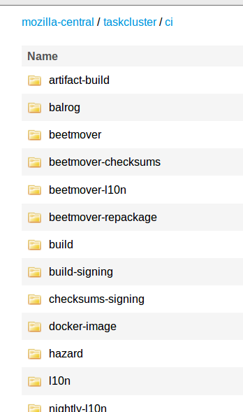

---

# Taskgraph Transforms
## Releng Tech Talk
### Oct 2017

---

## Follow along?
##### Only if you want to

- Slides: [http://tinyurl.com/ybck99ku](https://gitpitch.com/Callek/slideshows/transforms_2017#/)
- Q&A Etherpad: [http://tinyurl.com/y9al38ry](https://public.etherpad-mozilla.org/p/tc_tech_talk_10_17)
- Video Recording Link TBD
  - (will add after-the-fact)

---

## What we will cover

 - What are the stages of taskgraph generation
   - and how can you test them locally |
 - What are and how do I work with _transforms_ </li> |

---

- Taskgraph is...
- Like a grocery store.. |
- Yes Really... |

+++

Suppose you want to make a meal, including baking a cake, so you want to go to
the grocery store.

 - The stores contents, itself, is your _full_ taskgraph. </li> |
 - Your shopping list (including: cake mix) is considered your _target_ tasks </li> |
 - The items you bring up to the register is your _optimized_ task list. </li> |
 - Any substitutions you make at home, would be your final task list (_morphed_) </li> |

<span class="fragment"><b>Lets go into those in a bit more detail.</b></span>

+++
#### _Full_ task set:

 - In the grocery store, all the items on the shelves are available to buy. |
 - In the taskgraph the full graph is similar |
   - all tasks you could possibly run are generated and represented |

<span class="fragment">The taskgraph fills the shelves in the _full_ stage.</span>

+++
#### _Target_ task set:

 - You enter the store with a shopping list, knowing that the store sells everything on it. |
   - You walk the aisles and pick up the items on your list. (One of these items is "Cake Mix")
 - Again in the taskgraph, the target set is the tasks you explicitly want to run. |

+++
#### _Target_ task set:

 - The target set must always be a subset of the full taskgraph |
 - The target set may alter based on repo metadata, |
   - e.g.: |
     - Project |
     - Set of files changed |
     - If the decision task is run via cron (using a target task method) |

+++
#### _Optimized_ task set:

- After you grab the cake mix, you look at its list of stuff you need: |
  - Eggs |
  - Frosting |
  - Buttermilk |
- You have frosting at home, from the last time you shopped. |
- You add Eggs to your list and go grab some. |
- You think you have buttermilk at home so you don't worry about it. |

+++
#### _Optimized_ task set:

- The optimized task set works similarly. |
  - It will make sure all its dependencies are selected (builds needed for the selected tests get run) |
    - In the grocery example this was the eggs. |
  - It will also try and avoid doing unnecessary work, for example it will avoid running docker-worker tasks if there was already a known one that succeeded. |
    - In the grocery example this was the frosting. |

Note:
 - When you are in the grocery store, after you pick up the cake mix, you see that
   you need to buy eggs and frosting for your cake. So you pick those up as well, even
   though they were not on your shopping list. You also realize it called for buttermilk,
   but you think you have some at home already, so you omit buying it.

+++
#### _Morphed_ task set:

- This is the final set of what will be submitted |
- Morphing consists of minor changes to the structure of the taskgraph that does not alter its actual meaning |
  - Examples include: |
    - When too many index routes are specified, morphs strip them off and submit indexing as a seperate task. |
    - Create a task to store mozharness (via BBB) uploads. |

---

### Locally Running
#### getting output of taskgraph stages...

+++

```shell
$ ./mach taskgraph --help
usage: mach [global arguments] taskgraph subcommand [subcommand arguments]

The taskgraph subcommands all relate to the generation of task graphs
for Gecko continuous integration.  A task graph is a set of tasks linked
by dependencies: for example, a binary must be built before it is tested,
and that build may further depend on various toolchains, libraries, etc.

Global Arguments:
  -v, --verbose         Print verbose output.
  -l FILENAME, --log-file FILENAME
                        Filename to write log data to.
  --log-interval        Prefix log line with interval from last message rather
                        than relative time. Note that this is NOT execution
                        time if there are parallel operations.
  --log-no-times        Do not prefix log lines with times. By default, mach
                        will prefix each output line with the time since
                        command start.
  -h, --help            Show this help message.
  --debug-command       Start a Python debugger when command is dispatched.
  --settings FILENAME   Path to settings file.

Sub Commands:
  action-callback       Run action callback used by action tasks
  action-task           Run the add-tasks task. DEPRECATED! Use 'add-tasks'
                        instead.
  add-talos             Run the add-talos task
  add-tasks             Run the add-tasks task
  backfill              Run the backfill task
  cron                  Run the cron task
  decision              Run the decision task
  full                  Show the full taskgraph
  morphed               Show the morphed taskgraph
  optimized             Show the optimized taskgraph
  target                Show the target task set
  target-graph          Show the target taskgraph
  tasks                 Show all tasks in the taskgraph
  test-action-callback  Run an action callback in a testing mode
```
@[1](Call mach taskgraph)
@[23,32-35](We're only using a few sub-tasks for our testing here)
@[32](full)
@[35](target)
@[34](optimized)
@[33](morphed)

+++

```shell
$ ./mach taskgraph full --help
usage: mach [global arguments] taskgraph full [command arguments]

Global Arguments:
  -v, --verbose         Print verbose output.
  -l FILENAME, --log-file FILENAME
                        Filename to write log data to.
  --log-interval        Prefix log line with interval from last message rather
                        than relative time. Note that this is NOT execution
                        time if there are parallel operations.
  --log-no-times        Do not prefix log lines with times. By default, mach
                        will prefix each output line with the time since
                        command start.
  -h, --help            Show this help message.
  --debug-command       Start a Python debugger when command is dispatched.
  --settings FILENAME   Path to settings file.

Sub Command Arguments:
  --tasks-regex TASKS_REGEX, --tasks TASKS_REGEX
                        only return tasks with labels matching this regular
                        expression.
  --no-optimize         do not remove tasks from the graph that are found in
                        the index (a.k.a. optimize the graph)
  --parameters PARAMETERS, -p PARAMETERS
                        parameters file (.yml or .json; see
                        `taskcluster/docs/parameters.rst`)`
  --labels, -L          Output the label for each task in the task graph
                        (default)
  --json, -J            Output task graph as a JSON object
  --verbose, -v         include debug-level logging output
  --quiet, -q           suppress all logging output
  --root ROOT, -r ROOT  root of the taskgraph definition relative to topsrcdir
$
$ ./mach taskgraph full --help
$ ./mach taskgraph target --help
$ ./mach taskgraph optimized --help
$ ./mach taskgraph morphed --help

```

@[1](Help output for the full graph)
@[24-26](Parameters file, can be grabbed from an existing decision task)
@[29](all subtasks mentioned here have a json option, to get the finer details of the state of the taskgraph)
@[34-37](Replace _full_ with another graph step discussed to test other parts)

---

### Taskgraph Generation

+++

### Loading

- Kinds



+++

#### taskcluster/ci/build/kind.yml

```yaml
# This Source Code Form is subject to the terms of the Mozilla Public
# License, v. 2.0. If a copy of the MPL was not distributed with this
# file, You can obtain one at http://mozilla.org/MPL/2.0/.

loader: taskgraph.loader.transform:loader

kind-dependencies:
   - toolchain

transforms:
   - taskgraph.transforms.build:transforms
   - taskgraph.transforms.build_attrs:transforms
   - taskgraph.transforms.build_lints:transforms
   - taskgraph.transforms.use_toolchains:transforms
   - taskgraph.transforms.job:transforms
   - taskgraph.transforms.task:transforms

jobs-from:
    - android.yml
    - android-stuff.yml
    - linux.yml
    - macosx.yml
    - windows.yml
```

@[5](loader definition)
@[7-8](kind-dependencies)
@[10-16](transforms processed in order)
@[11]
@[12]
@[13]
@[14]
@[15]
@[16]
@[18-25](any other keys in the kind.yml are loader specific)

+++

##### Notes about loaders

- kind-dependencies only determine the order of the kinds loading. |
  - Has no direct bearing on the task dependencies generated. |
- transforms evaluate one at a time, in order, based on the configuration supplied by the kind.yml with inputs from the loader function |
- before the loader for the next kind being loaded is called, all tasks for the prior kinds are defined in the full graph |

---

### Transform Structure

+++?code=source_files/taskcluster_taskgraph_transforms_build.py&lang=python

@[0](Using a real file taskcluster/taskgraph/transforms/build.py)
@[9,11,14](Boilerplate)
@[17](@transforms.add decorator, adds the function to list of transforms)
@[18](First transform in file)
@[18](Transforms are given a config which has access to the kind config and parameters)
@[18](And a set of jobs/tasks to iterate over and perform, ahem, transforms, on)
@[19](It is best practice to have a docstring)
@[44-45](The second transform in this file runs next)
@[50,56](Transforms are implemented as generators, so iterate over the list of tasks)

+++

### Schemas

- Help enforce known-configurations during a tasks journey through transforms |
- They can be defined as needed in new transforms, and are meant to assist in sane option passing |

+++?code=source_files/taskcluster_taskgraph_transforms_signing.py&lang=python

@[0](Using a real file taskcluster/taskgraph/transforms/signing.py)
@[15](For schema validation we use the voluptuous package)
@[12](We import the Schema definition from _taskgraph.util.schema_ which is extended from voluptuous)
@[12](This enforces some style consistency in the schemas)
@[29-35](We define the schema)
@[65-71](Then validate it via a transform, ensuring that any task definitions passed in, validate here)

+++

#### Error conditions from schemas

- Schemas help identify error cases, usually broken transforms or task configurations.
- They could look something like:

```shell
Exception: In signing (u'build-signing' kind) task for u'build-android-api-16-old-id-nightly/opt':
extra keys not allowed @ data[u'invalid_key']
{u'dependent-task': Task(u'build', u'build-android-api-16-old-id-nightly/opt', {'nightly': True, u'build_platform': u'android-api-16-old-id-nightly', u'kind': u'build', u'build_type': u'opt', u'run_on_projects': ['mozilla-central']}, {u'scopes': [u'secrets:get:project/taskcluster/gecko/hgfingerprint', u'docker-worker:relengapi-proxy:tooltool.download.public', u'docker-worker:relengapi-proxy:tooltool.download.internal', u'secrets:get:project/releng/gecko/build/level-3/*', u'assume:project:taskcluster:level-3-sccache-buckets', u'docker-worker:cache:level-3-mozilla-central-build-android-api-16-old-id-nightly-opt-workspace-9ff613efacb0ceb91f00', u'docker-worker:cache:level-3-checkouts-9ff613efacb0ceb91f00', u'docker-worker:cache:level-3-tooltool-cache-9ff613efacb0ceb91f00'], u'tags': {u'os': u'linux', u'createdForUser': 'ffxbld@noreply.mozilla.org', u'worker-implementation': u'docker-worker', u'kind': u'build'}, u'expires': {u'relative-datestamp': u'1 year'}, u'deadline': {u'relative-datestamp': u'1 day'}, u'payload': {u'onExitStatus': {u'retry': [4]}, u'maxRunTime': 7200, u'image': {u'path': u'public/image.tar.zst', u'type': u'task-image', u'taskId': {u'task-reference': u'<docker-image>'}}, u'cache': {u'level-3-tooltool-cache-9ff613efacb0ceb91f00': u'/builds/worker/tooltool-cache', u'level-3-mozilla-central-build-android-api-16-old-id-nightly-opt-workspace-9ff613efacb0ceb91f00': u'/builds/worker/workspace', u'level-3-checkouts-9ff613efacb0ceb91f00': u'/builds/worker/checkouts'}, u'artifacts': {u'public/build': {u'path': u'/builds/worker/artifacts/', u'expires': {u'relative-datestamp': u'1 year'}, u'type': u'directory'}}, u'command': [u'/builds/worker/bin/run-task', u'--vcs-checkout', u'/builds/worker/workspace/build/src', u'--tools-checkout', u'/builds/worker/workspace/build/tools', u'--', u'/builds/worker/workspace/build/src/taskcluster/scripts/builder/build-linux.sh'], u'env': {u'MH_BRANCH': 'mozilla-central', u'MOZ_BUILD_DATE': '20171002174652', u'TASKCLUSTER_CACHES': u'/builds/worker/checkouts;/builds/worker/tooltool-cache;/builds/worker/workspace', u'MH_BUILD_POOL': u'taskcluster', u'HG_STORE_PATH': u'/builds/worker/checkouts/hg-store', u'GECKO_HEAD_REV': '15f221f491f707b1e8e46da344b6dd5a394b1242', u'MOZ_TOOLCHAINS': {u'task-reference': u'public/build/sccache2.tar.xz@<toolchain-linux64-sccache>'}, u'MOZ_SCM_LEVEL': '3', u'MOZHARNESS_SCRIPT': 'mozharness/scripts/fx_desktop_build.py', u'MOZHARNESS_ACTIONS': u'get-secrets build multi-l10n update', u'TASKCLUSTER_VOLUMES': u'/builds/worker/checkouts;/builds/worker/tooltool-cache;/builds/worker/workspace', u'GECKO_BASE_REPOSITORY': 'https://hg.mozilla.org/mozilla-central', u'TOOLTOOL_CACHE': u'/builds/worker/tooltool-cache', u'GECKO_HEAD_REPOSITORY': 'https://hg.mozilla.org/mozilla-central', 'TOOLTOOL_MANIFEST': 'mobile/android/config/tooltool-manifests/android/releng.manifest', u'MOZHARNESS_CONFIG': u'builds/releng_base_android_64_builds.py disable_signing.py platform_supports_post_upload_to_latest.py taskcluster_nightly.py', u'USE_SCCACHE': u'1', u'MH_CUSTOM_BUILD_VARIANT_CFG': 'api-16-old-id', u'MOZ_AUTOMATION': u'1'}, u'features': {u'taskclusterProxy': True, u'relengAPIProxy': True, u'chainOfTrust': True}}, u'provisionerId': u'aws-provisioner-v1', u'workerType': u'gecko-3-b-android', u'created': {u'relative-datestamp': u'0 seconds'}, u'extra': {u'index': {u'rank': 1506966412}, u'treeherderEnv': [u'production', u'staging'], u'treeherder': {u'jobKind': u'build', u'groupSymbol': 'tc', u'collection': {u'opt': True}, u'machine': {u'platform': u'android-4-0-armv7-api16-old-id'}, u'groupName': u'Executed by TaskCluster', u'tier': 1, u'symbol': 'N'}, u'chainOfTrust': {u'inputs': {u'docker-image': {u'task-reference': u'<docker-image>'}}}}, u'priority': u'medium', u'routes': [u'index.gecko.v2.mozilla-central.nightly.latest.mobile.android-api-16-old-id-opt', u'index.gecko.v2.mozilla-central.nightly.2017.10.02.revision.15f221f491f707b1e8e46da344b6dd5a394b1242.mobile.android-api-16-old-id-opt', u'index.gecko.v2.mozilla-central.nightly.2017.10.02.latest.mobile.android-api-16-old-id-opt', u'index.gecko.v2.mozilla-central.nightly.revision.15f221f491f707b1e8e46da344b6dd5a394b1242.mobile.android-api-16-old-id-opt', u'index.gecko.v2.mozilla-central.revision.15f221f491f707b1e8e46da344b6dd5a394b1242.mobile-l10n.android-api-16-old-id-opt.en-US', u'index.gecko.v2.mozilla-central.pushdate.2017.10.02.20171002174652.mobile-l10n.android-api-16-old-id-opt.en-US', u'index.gecko.v2.mozilla-central.latest.mobile-l10n.android-api-16-old-id-opt.en-US', u'index.gecko.v2.mozilla-central.revision.15f221f491f707b1e8e46da344b6dd5a394b1242.mobile-l10n.android-api-16-old-id-opt.multi', u'index.gecko.v2.mozilla-central.pushdate.2017.10.02.20171002174652.mobile-l10n.android-api-16-old-id-opt.multi', u'index.gecko.v2.mozilla-central.latest.mobile-l10n.android-api-16-old-id-opt.multi', u'tc-treeherder.v2.mozilla-central.15f221f491f707b1e8e46da344b6dd5a394b1242.32615', u'tc-treeherder-stage.v2.mozilla-central.15f221f491f707b1e8e46da344b6dd5a394b1242.32615'], u'metadata': {u'owner': 'ffxbld@noreply.mozilla.org', u'source': u'https://hg.mozilla.org/mozilla-central/file/15f221f491f707b1e8e46da344b6dd5a394b1242/taskcluster/ci/build', u'description': u'Android 4.0 api-16+ OldId Nightly ([Treeherder push](https://treeherder.mozilla.org/#/jobs?repo=mozilla-central&revision=15f221f491f707b1e8e46da344b6dd5a394b1242))', u'name': u'build-android-api-16-old-id-nightly/opt'}}, optimization={u'skip-unless-schedules': [u'android']}, dependencies={u'toolchain-linux64-sccache': u'toolchain-linux64-sccache', u'docker-image': u'build-docker-image-android-build'}),
 u'invalid_key': u'Test',
 u'label': u'build-signing-android-api-16-old-id-nightly/opt',
 u'routes': [u'index.gecko.v2.mozilla-central.signed-nightly.nightly.latest.mobile.android-api-16-old-id-opt',
             u'index.gecko.v2.mozilla-central.signed-nightly.nightly.2017.10.02.revision.15f221f491f707b1e8e46da344b6dd5a394b1242.mobile.android-api-16-old-id-opt',
             u'index.gecko.v2.mozilla-central.signed-nightly.nightly.2017.10.02.latest.mobile.android-api-16-old-id-opt',
             u'index.gecko.v2.mozilla-central.signed-nightly.nightly.revision.15f221f491f707b1e8e46da344b6dd5a394b1242.mobile.android-api-16-old-id-opt',
             u'index.gecko.v2.mozilla-central.signed-nightly.revision.15f221f491f707b1e8e46da344b6dd5a394b1242.mobile-l10n.android-api-16-old-id-opt.en-US',
             u'index.gecko.v2.mozilla-central.signed-nightly.pushdate.2017.10.02.20171002174652.mobile-l10n.android-api-16-old-id-opt.en-US',
             u'index.gecko.v2.mozilla-central.signed-nightly.latest.mobile-l10n.android-api-16-old-id-opt.en-US',
             u'index.gecko.v2.mozilla-central.signed-nightly.revision.15f221f491f707b1e8e46da344b6dd5a394b1242.mobile-l10n.android-api-16-old-id-opt.multi',
             u'index.gecko.v2.mozilla-central.signed-nightly.pushdate.2017.10.02.20171002174652.mobile-l10n.android-api-16-old-id-opt.multi',
             u'index.gecko.v2.mozilla-central.signed-nightly.latest.mobile-l10n.android-api-16-old-id-opt.multi'],
 u'upstream-artifacts': [{u'formats': [u'jar'],
                          u'paths': [u'public/build/target.apk',
                                     u'public/build/en-US/target.apk'],
                          u'taskId': {u'task-reference': u'<build>'},
                          u'taskType': u'build'}]}
```
@[1](The exception itself)
@[2](Informative message about why its invalid)
@[3-30](Followed by a dump of the json of the currently evaluated job definition)

+++

### Dependencies

- The taskgraph takes dependency information by a dict with task labels as values. |
  - The keys to the dictionary are arbitrary but relevant for the optimization phase |

+++

### Dependencies

```shell
$./mach taskgraph full -p ../parameters-central.yml --json > ../tasks.json
$ jq '{"dependencies": .["build-signing-win64/opt"]["dependencies"]}' < ../tasks.json
{
  "dependencies": {
    "build": "build-win64/opt"
  }
}
```
@[0](In this example, we look at the _build-signing-win64/opt_ task)
@[5](_build-win64/opt_ is the dependency)
@[5](We'll talk about what the key, _build_, can be used for, next)

+++

### Task-Reference

- In the taskgraph, there is sometimes the need to reference another defined task by taskID |
  - E.g. to give an artifact URL in the environment |
- This syntax is defined by the dictionary ```{"task-reference": "some string <key>"}``` </li> |
  - The key here corresponds to the key used in the dependency, and can appear anywhere in the string. |

+++
### Task-Reference

```shell
$ jq '{"dependencies": .["nightly-l10n-win64-nightly-1/opt"]["dependencies"], "task": {"payload": {"env": {"EN_US_BINARY_URL": .["nightly-l10n-win64-nightly-1/opt"]["task"]["payload"]["env"]["EN_US_BINARY_URL"]}}}}' < ../tasks.json
{
  "dependencies": {
    "repackage-signed": "repackage-signing-win64-nightly/opt",
    "signed-build": "build-signing-win64-nightly/opt",
    "unsigned-build": "build-win64-nightly/opt"
  },
  "task": {
    "payload": {
      "env": {
        "EN_US_BINARY_URL": {
          "task-reference": "https://queue.taskcluster.net/v1/task/<signed-build>/artifacts/public/build"
        }
      }
    }
  }
}
```
@[0](This is a minimized look at the full output of the nightly-l10n-win64-nightly-1/opt task)
@[0](Showing both the dependencies and one specific environment var using the task-reference information)
@[11-13](This task-reference is using the dependency key _signed-build_)
@[12](These keys against the dependency list get validated in the optimized stage, along with the labels used in task dependencies)
@[12](This could evaluate to 'https://queue.taskcluster.net/v1/task/GT4uxctWTDqtYpUrK7CLrA/artifacts/public/build')

+++

### Local Debugging

- Since transforms execute in order, there are a variety of local debugging options
  - PDB ```import pdb;pdb.set_trace()``` </li> |
  - print debugging |
  - Repeated runs with output directed somewhere. |
  - Many more options |
- To validate dependencies when making changes, run the _optimize_ step with an appropriate taskgraph before completing. |
  - This ensures that the dependency links and any _task-references_ are valid |

---

## Further Reading

- Repeat Slides: http://tinyurl.com/ybck99ku
  - https://gitpitch.com/Callek/slideshows/transforms_2017#/
- [https://firefox-source-docs.mozilla.org/taskcluster/taskcluster/index.html](Taskcluster's Firefox Source Docs)

---

## Q&A
### http://bit.ly/...
